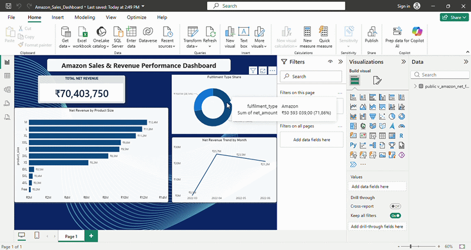

# 📊 Amazon Sales & Revenue Performance Analytics Pipeline

A self-directed data engineering and portfolio framework modeling high-scale transactional payloads based on global Amazon Seller Central streams. This project executes a robust Python and SQL pipeline over a large-scale e-commerce dataset containing **128,975 transactional records**, systematically uncovering **₹8.1 Million in hidden losses** due to cancellations and product returns.

## 🚀 Interactive Dashboard Preview


---

## 🏗️ Architecture Design: Self-Healing & Automated Verification Layout
To maximize repository reliability and data product safety across enterprise e-commerce tracking networks, the framework deploys a strict multi-layered engineering and validation layout:
1. **Self-Healing Pre-Load Layer:** Automatically coerces incoming data structure alignments (e.g., preventing schema drift by casting Order IDs to clean strings) and strips alphanumeric grouping formatting or currency markers before numeric conversion.
2. **Automated Unit Testing (`pytest`):** Core transformation algorithms are fully decoupled into pure isolated functions, verified against table-driven test vectors, edge-case currency parameters, and structural data noise inputs.
3. **Declarative Schema Validation (`pandera`):** The data ingestion pipeline is armed with a strict semantic quality schema layer. It screens records for missing attributes (`Null`), duplicate flags, boundary ranges, and structural typing variations before writing records downstream.

---

## 🔗 Dataset Provenance & Disclosure (Clone & Run Standard)
* **Data Source:** Publicly verified [Amazon Sale Report dataset via Kaggle](https://kaggle.com).
* **Scale:** 128,975 raw rows capturing transactions from Amazon India.
* **Testing Vibe:** This repository contains a lightweight **`Amazon_sales_sample.csv`** to ensure full reproducibility and execution checks for reviewers and target clients without requiring heavy local system storage or processing overhead.

---

## 🎯 Engineered Financial Insights
By deploying high-precision numeric types and strict data quality boundaries, this project systematically isolates transactional anomalies to calculate true commercial performance metrics across the Amazon India network:

1. **The Revenue Leakage:** Total Gross Revenue was calculated at **₹78,592,678.30**. By building strict status-filtering layers, the actual **Net Revenue (Clean)** was isolated at **₹70,403,750.00**, proving that **₹8,188,928.30 (10.4% of gross volume)** was tied up in logistics failures (cancellations and returns).
2. **The Product Leader:** The **"Set"** product category stands as the core revenue driver, registering **50,284 successful orders** and yielding **₹35,100,949** in sanitized net revenue.
3. **Inventory Sweet Spot:** Size **"M"** systematically dominates order velocity across all main product lines, establishing the highest high-volume transaction metrics.
4. **Commercial Peak:** Time-series sorting identifies **April 2022 (Month 04)** as the highest historical revenue spike.

---

## 🛠️ Tech Stack & Pipeline Configurations
- **Data Engineering:** Python (Pandas) executing an inline self-healing text cleanup matrix and strict type formatting via `pandera.pandas`. High-precision accounting aggregates utilize `decimal.Decimal` logic to completely eliminate binary float drifting. Loose zero-interpolations (`.fillna(0)`) are entirely deprecated.
- **Testing Suite:** `pytest` executing parametrized, table-driven unit tests to simulate and intercept raw input anomalies.
- **Database Architecture:** PostgreSQL (SQLAlchemy + `psycopg2-binary`) deploying optimized bulk block write configurations (`chunksize=10000`) and secure Connection Pooler layers (Port `6543`), featuring automated local file backup routing.
- **BI Visualization:** Power BI Desktop configured with custom localization schemas for the Indian Rupee (`₹`) financial system, optimized for flawless metric aggregations (`SUM()` and `AVERAGE()`).

---

## 📁 Repository Directory Structure

```text
amazon-sales-analytics/
└── amazon_sales/
    ├── Amazon_sales_sample.csv            # Custom Ingestion Sample Dataset
    ├── amazon_analytics.py                # Main Core Analytics Engine & Pandera Shield Verification
    ├── amazon_ingestion.py                # Relational Storage Ingestion Stream Blueprint
    ├── test_amazon.py                     # Automated Pytest Suite & Code Crash Simulator
    ├── requirements.txt                   # Locked Software Dependency Layout
    └── README.md                          # Enterprise Systems Documentation
```

---

## 🚀 Quick Start (Clone & Run Standard)

### 1. Replicate Local Dependencies
Deploy the isolated software version scheme inside your local execution environment:
```powershell
pip install -r requirements.txt
```

### 2. Execute Automated Code Testing
Run the complete unit testing suite using the built-in crash-test vectors to verify validation stability:
```powershell
pytest test_amazon.py -v
```

### 3. Run the Local Financial Validation Audit
To verify the analytical layer using the pre-packaged sample data pool, execute:
```powershell
python amazon_analytics.py
```

### 4. Inspect the Ingestion Architecture Blueprint
Test the dual-mode framework pipeline to inspect database ingestion scalability configurations:
```powershell
python amazon_ingestion.py
```

---
*Engineered under the UpDataLogic Performance Framework for transparent, honest, and reproducible analytics pipelines.*
